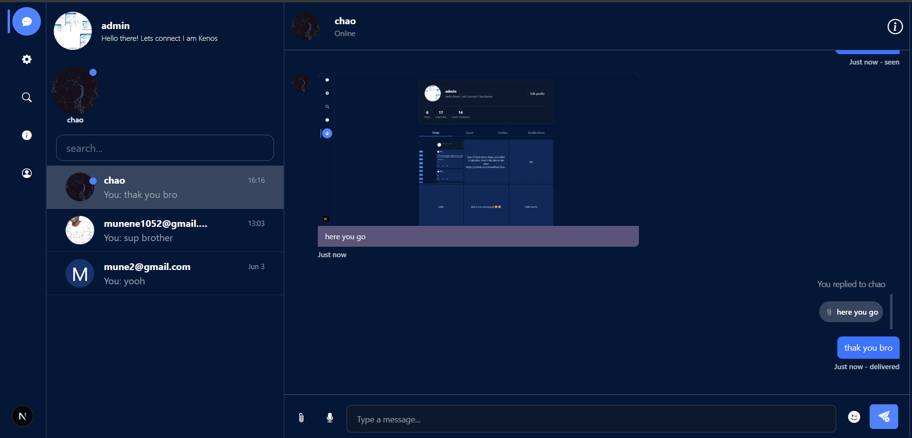
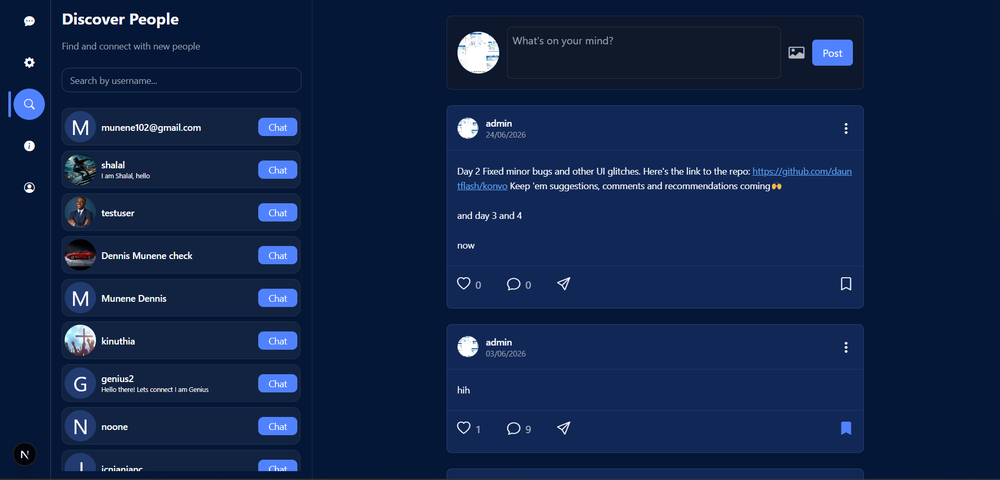
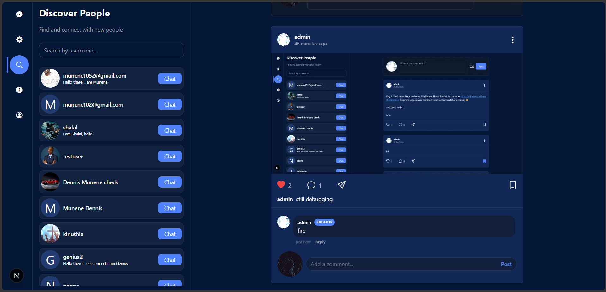
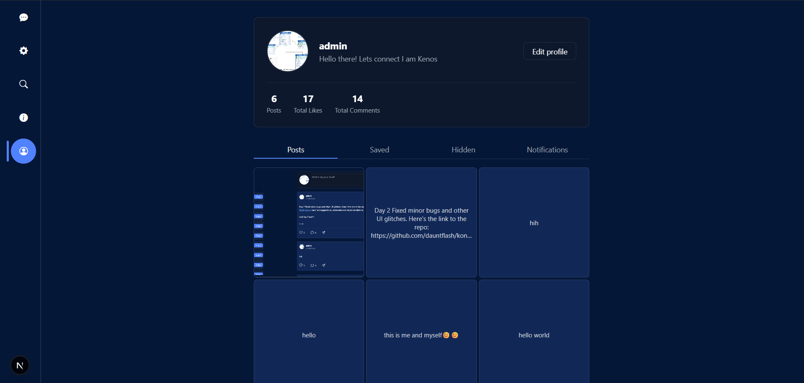
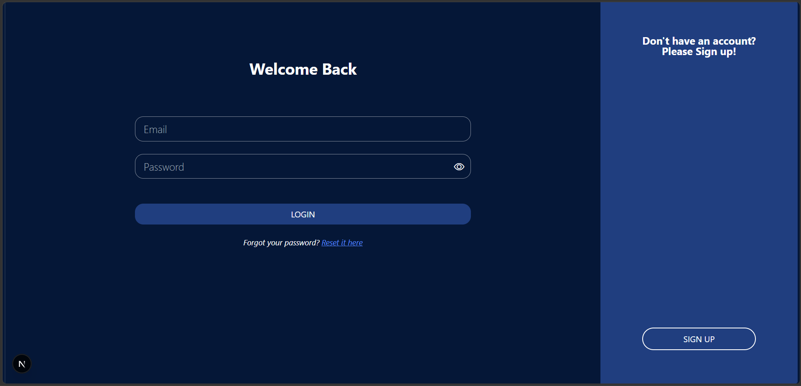
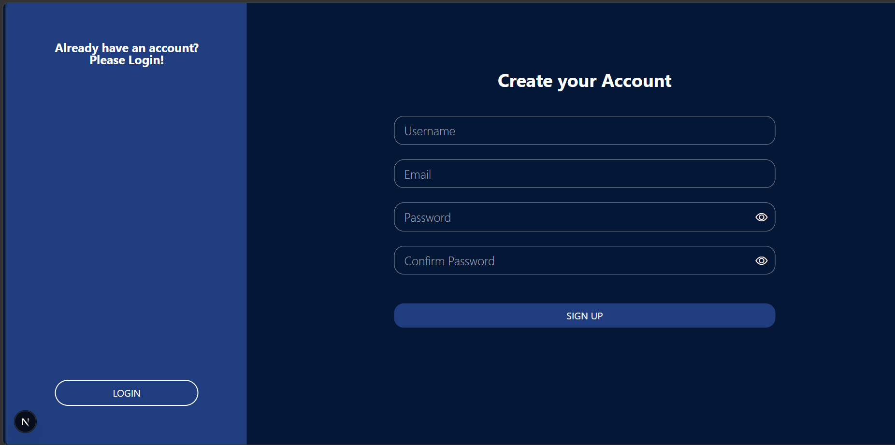

# Konvo

A real-time chat app with a social feed built in. Message people, send voice notes and files, then flip over to the feed and post something for everyone. Built with Next.js 15 and PocketBase.


**[Try the live demo](https://konvo-opal.vercel.app)**
Login with `demo@konvo.app` / `demo1234`

It's a shared account, so anything you post on the feed is public. Keep it clean.



---

## What you can do

### Chat

- Messages show up instantly, no refreshing
- See when someone is typing, and whether your message was sent, delivered or seen
- Reply to a specific message so the context doesn't get lost
- Record and send **voice notes** with the mic button next to the message box
- Send images, videos, audio, documents, or snap a photo with your camera
- Emoji picker built in
- Set a different wallpaper for each conversation
- Clear a chat's history on your side without touching the other person's copy
- Online status and unread markers in the chat list

### Feed



- Post text with an optional image
- Like, comment, reply to comments, and save posts for later
- Get notified when someone likes or comments on your post
- Report posts that shouldn't be there
- The post author's comments carry a `CREATOR` badge, so it's easy to spot them in a long thread



### Finding people

The Discover People panel lists everyone on the platform. Search by username and hit **Chat** to start talking.

### Profiles



Every profile shows post, like and comment counts. Your own profile has tabs for your posts, saved posts, hidden posts and notifications. You can also block and unblock users.

### Sign up and login

<table>
  <tr>
    <td></td>
    <td></td>
  </tr>
</table>

Email and password auth, with a password reset link if you forget yours.

---

## Tech stack

| Layer     | What I used                                     |
|-----------|-------------------------------------------------|
| Framework | [Next.js 15](https://nextjs.org/) + TypeScript  |
| Backend   | [PocketBase](https://pocketbase.io/)            |
| Styling   | Tailwind CSS                                    |
| Icons     | Bootstrap Icons                                 |
| Extras    | React Toastify, Emoji Picker React, React Select |

PocketBase handles the database, auth, file storage and realtime subscriptions in one binary, which is why there's no separate backend folder in this repo.

---

## Run it locally

You'll need Node.js 18 or newer and the [PocketBase binary](https://pocketbase.io/docs/) for your OS.


Tested with PocketBase version 0.40.4

**1. Clone and install**

```bash
git clone https://github.com/dauntflash/konvo.git
cd konvo
npm install
```

**2. Start PocketBase**

Put the binary in the project root (or anywhere you like) and run:

```bash
./pocketbase serve --http=0.0.0.0:8090
```

**3. Import the schema**

1. Open the admin panel at `http://localhost:8090/_/` and create your admin account
2. Go to **Settings → Import collections**
3. Paste in or upload [`pb_schema.json`](./pb_schema.json) and click **Import**

That creates every collection for you.

**4. Add your env file**

Create `.env.local` in the project root:

```env
NEXT_PUBLIC_PB_URL=http://localhost:8090
```

**5. Start the app**

```bash
npm run dev
```

Open [http://localhost:3000](http://localhost:3000) and sign up.

---

## Database

You don't have to build these by hand, `pb_schema.json` does it. For reference:

| Collection      | What it stores                                                           |
|-----------------|--------------------------------------------------------------------------|
| `users`         | Auth collection: username, avatar, about, wallpaper, typing status       |
| `posts`         | Feed posts with captions, images, likes and saves                        |
| `comments`      | Comments and replies on posts                                            |
| `messages`      | Private messages, attached files, read status, reply references          |
| `notifications` | Alerts for likes, comments and other activity                            |
| `reports`       | Post reports from users                                                  |
| `blocks`        | Who has blocked whom                                                     |

---

## Project structure

```
konvo/
├── app/               # Next.js app router: pages and layouts
├── lib/               # PocketBase client and helper functions
├── public/
│   └── bgImages/      # Chat wallpaper options
├── docs/
│   └── screenshots/   # Images used in this README
├── pb_schema.json     # PocketBase collections, import this first
└── .env.local         # Your env variables (you create this)
```

---

## Deploying

**Frontend:** Vercel is the easy route.

[](https://vercel.com/new/clone?repository-url=https://github.com/dauntflash/konvo)

Set `NEXT_PUBLIC_PB_URL` in the Vercel environment settings to your hosted PocketBase URL.

**Backend:** PocketBase is a single binary, so any VPS works (DigitalOcean, Railway, Fly.io and so on). The [production guide](https://pocketbase.io/docs/going-to-production/) covers the setup.

One thing that trips people up: if your frontend is on https, your PocketBase server needs to be on https too, or the browser will block the requests.

---

## Status and what's next

Konvo is desktop-first right now. On a phone the layout isn't ready yet.

- [ ] Mobile layout
- [ ] Group chats


---

## Contributing

Bug reports, ideas and pull requests are all welcome. If it's a big change, open an issue first so we can talk it through before you spend time on it.

1. Fork the repo
2. Make a branch: `git checkout -b feature/your-feature`
3. Commit and push your changes
4. Open a pull request

---

## License

MIT. See [LICENSE](./LICENSE).
